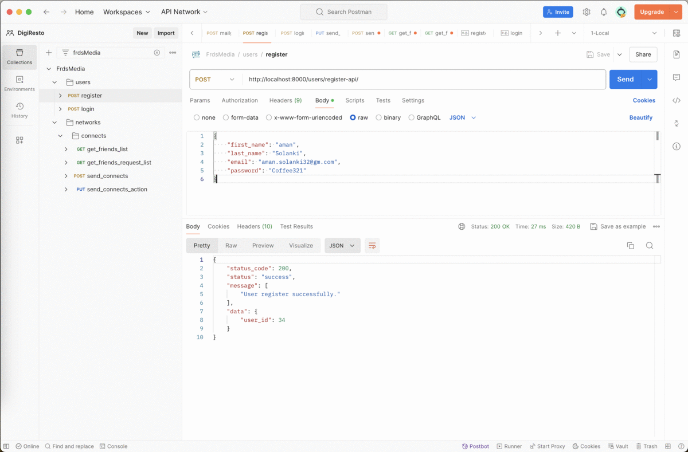

Social Media App

---
## Steps to install project

> - Download form GitHub:
> $ git clone https://github.com/er-ashissh/friends-media.git

> - Create Virtual enviornment:
> $ virtualenv -p python3.8 venv

> - Activate venv by hitting below command
> $ source venv/bin/activate

> - Run Application
> $ python3 proj/manage.py runserver

---
## Postman Collection link:
- 

---
## Demo API
- demo in gif format:
